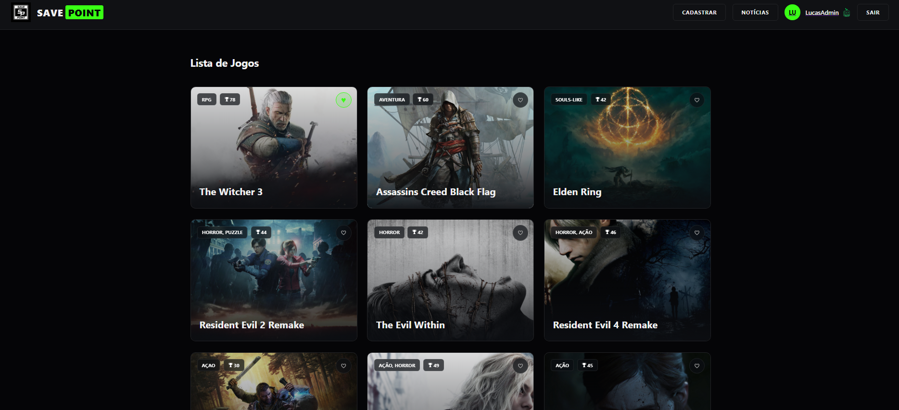

# Save Point - Biblioteca de Jogos

Aplicação web full-stack para gerenciamento de uma coleção de jogos, permitindo
cadastrar, consultar, editar e excluir registros de forma organizada.

## 🚀 Tecnologias

- **Front-end:** React, CSS3
- **Back-end:** Node.js, Express
- **Banco de Dados:** MySQL

## ✨ Funcionalidades

- Cadastro de jogos com validação de dados
- Listagem de jogos com paginação
- Edição e exclusão de registros
- Visualização detalhada de jogos por ID
- Armazenamento e gerenciamento dos dados utilizando MySQL
- Validações realizadas no backend
- Interface em tema Dark

## 🗄️ Estrutura do Banco de Dados

O projeto utiliza MySQL para armazenamento das informações dos jogos.

O script de criação das tabelas e inserção dos dados iniciais está disponível em:

`./database/games_system_export.sql`

Para executar o banco, importe o arquivo no MySQL Workbench.

## ▶️ Como executar

### 1. Instalar as dependências

No diretório raiz do projeto:

```bash
npm run install-all
```

### 2. Preparar os dados

```bash
npm run backfill
```

### 3. Iniciar a aplicação

```bash
npm run dev
```

## 📌 Sobre o projeto

Projeto desenvolvido como parte da formação em Ciência da Computação,
com foco na aplicação prática de conceitos de desenvolvimento web,
operações CRUD, integração com banco de dados e validação de informações.

## 📸 Preview
